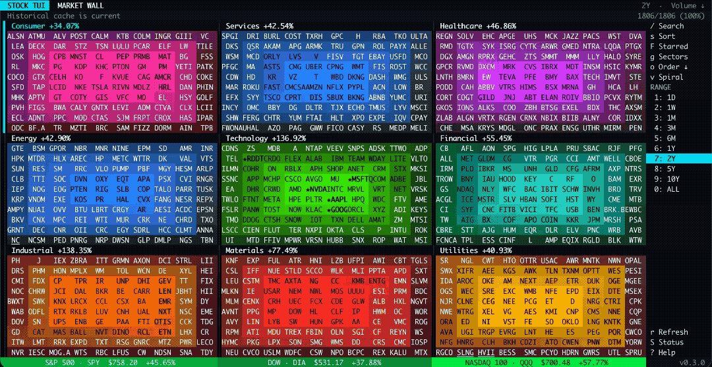
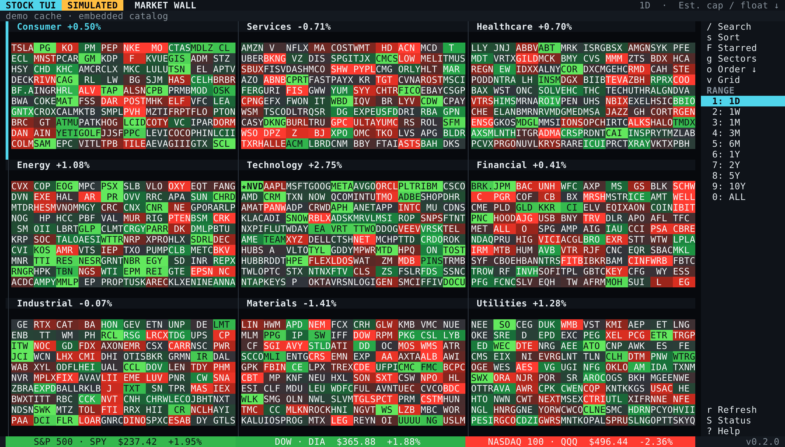
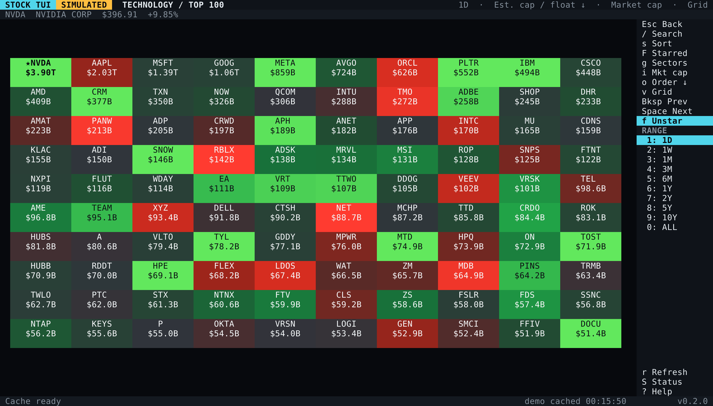
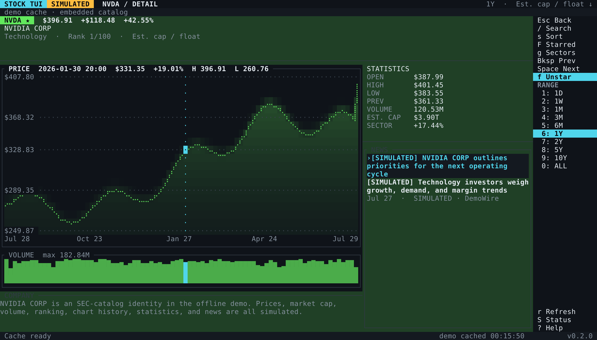

# stock-tui

`stock-tui` is a mouse-first terminal stock heatmap inspired by the visual
model of StockTouch. It turns a broad US equity universe into a dense 3x3
market map, lets you open a sector's top 100 companies, and then drills into a
ticker with price, volume, statistics, and related news.

[](docs/screenshots/stock-tui-2.gif)

This is an independent open-source project. It is not affiliated with,
endorsed by, or a continuation of StockTouch or its creators.

The client is written in Rust with Ratatui, Crossterm, Tokio, and SQLite. It is
read-only: it displays market information and does not place orders.

The iterative Codex work performed through chatcode.dev is documented in the
[prompt-to-commit build log](PROMPTS.md).

> **Project status:** early, pre-1.0 software. The cache format and provider
> behavior may change between minor releases. All market information may be
> delayed, incomplete, or wrong. `stock-tui` is not investment advice.

## Screenshots

These v0.2.0 captures use the deterministic offline demo at a 140x42 terminal
viewport. Company identities are real SEC-catalog entries; all displayed
prices, returns, volumes, rankings, and news are simulated.

### Market Overview

Nine sectors, each containing 100 equally sized ticker signals, plus selectable
S&P 500, Dow, and Nasdaq-100 ETF proxies.

[](docs/screenshots/market-overview.png)

### Sector View

Technology ranked by estimated market cap, with one metric per tile and starred
NVDA emphasized.

[](docs/screenshots/technology-sector.png)

### Ticker Detail

The one-year NVDA view with a movable chart cursor, price and time axes, volume,
statistics, related news, sector rank, and absolute and relative gain.

[](docs/screenshots/ticker-detail.png)

## What It Does

- Displays nine economic sectors in a 3x3 overview, with up to 100 companies
  per sector.
- Shows S&P 500, Dow, and Nasdaq-100 performance through the liquid `SPY`,
  `DIA`, and `QQQ` ETF proxies in the overview footer.
- Colors tickers by period return in every ordering except Volume: losses run
  bright red, neutral returns gray, and gains bright green. Volume ordering
  instead distinguishes sectors by stable hues in color themes and uses
  brightness for sector-relative cumulative share volume over the selected
  range. Monochrome mode uses brightness only.
- Reorders tickers by estimated market cap with SEC public-float fallback,
  gain, volume, or symbol.
- Provides responsive sector grids and a ticker detail screen with a
  time-spaced Braille price trace, softly filled tint, price/time axes,
  exact cursor labels, cached-history coverage, a fine-grained volume
  histogram, current-order rank, statistics, concise company context, and
  news.
- Supports mouse hover, clicking, wheel input, keyboard navigation, and
  terminal resize events.
- Searches cached companies by symbol or company name, including retained
  provider assets outside the current top-100 universe.
- Persists starred tickers and emphasizes them in every heatmap.
- Opens immediately from a local SQLite cache while network synchronization
  proceeds in the background.
- Refreshes its compact SEC-derived issuer catalog from a public R2 object,
  while retaining a validated catalog inside every release for offline and
  outage-safe startup.
- Runs an explicitly selected demo, via `--demo` or onboarding, using 900 real
  SEC-catalog issuer identities plus three benchmark ETF identities, with
  deterministic, clearly labeled simulated market values.

For every ordering except Volume, the return heat scale is symmetric around
zero and capped using the visible market's 90th-percentile absolute move.
Volume uses a separate log scale within each sector, bounded by its 10th and
90th percentiles, so exceptional prints do not flatten brightness. `1D` uses
the selected snapshot's latest-session cumulative volume when available, with
a cached bar-sum fallback; longer ranges sum cached OHLCV bar volume inside the
selected cutoff. Range changes therefore update Volume ordering, tile values,
and brightness. Missing return or range-volume data appears neutral. When the
selected price endpoint is more than 72 hours old, only the ticker label is
underlined as a freshness hint while retaining a contrast-aware foreground.
Provider bars that explicitly describe no trading (zero volume, zero or absent
trade count, and identical OHLC prices) remain in the raw cache but do not
become price endpoints, refresh freshness, extend history coverage, or create a
flat chart plateau.

## Why Rust

Go would also be a reasonable implementation language, but Rust is a stronger
fit for this client: Ratatui provides precise cell and canvas rendering
support, Crossterm supplies portable mouse and keyboard events, Tokio handles
background provider work, and `rusqlite` can bundle SQLite into one native
binary. The result has no language runtime to install and keeps redraw and
cache paths explicit.

## Quick Start

### Requirements

- Rust 1.95 or newer for a source build
- A native C compiler and linker for bundled SQLite and TLS dependencies
- A modern terminal with UTF-8 and mouse reporting
- At least 60 columns by 20 rows; 120 by 36 or larger enables the full layout
- True-color support for the intended palette (256-color terminals still run,
  but color reproduction depends on the terminal)

Start the live client:

```bash
cargo run --release
```

Use `stock-tui --help` or `stock-tui -h` to list all command-line options.

When no credentials are configured, `stock-tui` shows Alpaca's registration
URL as a highlighted OSC 8 terminal link and waits: press `Enter` to open it,
`c` to copy it through the terminal clipboard, `d` to start demo mode, or `Esc`
to continue directly to credential entry. It accepts the key ID and secret
through hidden terminal input, validates the pair, and stores it under
`[providers.alpaca]` in the platform `config.toml`. A complete usable pair from
the process environment or a working-directory `.env` skips credential entry.
Alpaca credentials never select a provider or override
`provider = "stock-api"`.

Use the simulated market explicitly when testing without provider data:

```bash
cargo run --release -- --demo
```

The first demo run selects 100 real SEC-catalog identities per sector and
generates simulated prices, rankings, multiple chart timeframes, volume, and
news, then stores them in SQLite. The persistent `SIMULATED` badge distinguishes
the demo from live Alpaca data. Demo and live mode use separate default
databases, `demo.sqlite3` and `market.sqlite3`, so adding credentials after a
demo run cannot combine their observations. Later runs reuse the versioned demo
database. Regenerate it with:

```bash
cargo run --release -- --demo --reset-demo
```

`--reset-demo` clears **the entire selected database**, including favorites and
any live cache, before regenerating it. This normally affects only the default
demo database; use a dedicated `--db` path when overriding it. No Alpaca account
or network connection is used in demo mode. Current versioned demo caches are
reused, and the old fabricated-identity demo is upgraded automatically.

### Use Alpaca Data

Alpaca's free Paper Trading account can issue credentials for the Basic market
data plan; no funded brokerage account is required. To configure it:

1. Create or sign in to an
   [Alpaca Trading API account](https://app.alpaca.markets/account/login).
2. Select **Paper Trading** in the dashboard account switcher.
3. Open the dashboard API Keys panel and generate a key pair. Store the secret
   immediately: Alpaca displays it only once, and regenerating a pair
   invalidates the previous credentials.
4. Launch `stock-tui` and enter both values when prompted. Input is not echoed,
   and the pair is validated before it is stored in the platform
   `config.toml`. Alternatively, put both values in the process environment,
   in a private `.env` file in the directory from which `stock-tui` is
   launched, or under `[providers.alpaca]` in that platform file:

```dotenv
ALPACA_API_KEY=your-own-key-id
ALPACA_API_SECRET=your-own-secret
```

```toml
[providers.alpaca]
api_key = "your-own-key-id"
api_secret = "your-own-secret"
```

For a source checkout, `.env.example` remains a ready-to-fill override:

```bash
cp .env.example .env
chmod 600 .env
```

Never commit `.env`, credentials, a populated database, or diagnostic output
that might contain account information. Do not paste secrets into commands that
will remain in shell history. Start the client with:

```bash
cargo run --release
```

For a prebuilt binary, run `stock-tui` from the private directory containing
`.env`, or export the variables in the launching shell. The dotenv loader
searches the current directory and its parents; it does not automatically
search beside an installed executable. Without either override, onboarding
updates `<config_dir>/config.toml`; find the exact directory with
`stock-tui --print-config` and keep a populated file private. Releases before
this storage change may have created `<config_dir>/credentials.env`; it remains
a read-only fallback until the pair is saved into TOML. The app reads asset
metadata from Alpaca's paper endpoint but never submits orders. If your
credentials belong to another Alpaca environment, set
`STOCK_TUI_TRADING_URL` to its matching HTTPS base URL.

The default `iex` feed works with Alpaca's Basic plan. See
[Data Providers](docs/data-providers.md) before selecting `sip` or
`delayed_sip`; access is controlled by the user's Alpaca subscription.
Alpaca's current
[Paper Trading guide](https://alpaca.markets/learn/start-paper-trading)
contains the authoritative dashboard steps if its interface changes.

Alpaca is the first provider adapter and remains the default. The provider is
selected explicitly with `--provider alpaca`, `STOCK_TUI_PROVIDER=alpaca`, or
`provider = "alpaca"` in `config.toml`. A provider-neutral HTTP adapter is also
available for compatible separately operated services:

```bash
stock-tui --provider stock-api --stock-api-url http://127.0.0.1:8787
```

Compatible services may be unauthenticated, or may require an optional bearer
token. Provider selection, base URL, optional news, and token can be kept in
`<config_dir>/config.toml`; `stock-tui --print-config` shows that directory.
A working-directory `config.toml` is not loaded automatically:

```toml
provider = "stock-api"

[providers.stock_api]
base_url = "https://stock.chatcode.dev/api"
news = true
token = "replace-with-an-out-of-band-token"
```

Keep a token-bearing file private and never commit it. The higher-precedence
`STOCK_TUI_STOCK_API_TOKEN` environment variable is useful for temporary
overrides. There is no CLI token flag, and `--print-config` omits both its
value and presence. For a one-session private endpoint test:

```bash
read -rsp "Stock API token: " STOCK_TUI_STOCK_API_TOKEN
printf '\n'
export STOCK_TUI_STOCK_API_TOKEN
stock-tui --provider stock-api --stock-api-url https://stock.chatcode.dev/api
unset STOCK_TUI_STOCK_API_TOKEN
```

The project-operated endpoint is for explicitly authorized development tests,
not a licensed public market-data service. See the
[Stock API HTTP Contract](docs/stock-api-contract.md) before operating a
service. The synchronization layer keeps separate asset, market-data, and
optional-news capabilities so provider payloads and authentication do not leak
into storage and UI code.

To inspect the effective non-secret settings and resolved paths:

```bash
cargo run --release -- --print-config
```

Credentials are redacted from this output. To prohibit all network access and
use an existing live-data cache:

```bash
cargo run --release -- --offline
```

`--offline` does not manufacture missing data. Run online at least once to
populate a live cache, or use `--demo` for a self-contained experience.

## Install

### Prebuilt Binaries

Download the release asset for your operating system and CPU from
[GitHub Releases](https://github.com/chatcode-lab/stock-tui/releases), verify
it against the attached `SHA256SUMS`, open or extract it, and place `stock-tui`
(or `stock-tui.exe`) on `PATH`.

| Platform | Release asset |
| --- | --- |
| Linux x86_64 | `stock-tui-v<VERSION>-x86_64-unknown-linux-musl.tar.gz` |
| Linux ARM64 | `stock-tui-v<VERSION>-aarch64-unknown-linux-musl.tar.gz` |
| macOS Apple Silicon | `stock-tui-v<VERSION>-aarch64-apple-darwin.tar.gz` |
| macOS Intel | `stock-tui-v<VERSION>-x86_64-apple-darwin.tar.gz` |
| Windows x86_64 | `stock-tui-v<VERSION>-x86_64-pc-windows-msvc.zip` |

Tagged macOS archives contain Developer ID-signed, hardened-runtime binaries
accepted by Apple's notary service. A standalone command-line executable and
its tar or ZIP transport cannot carry a stapled ticket, so Gatekeeper retrieves
the notarization ticket online. Maintainer details are in
[Release Process](docs/releasing.md).

The GitHub CLI can display and download the latest available assets:

```bash
gh release view --repo chatcode-lab/stock-tui
gh release download --repo chatcode-lab/stock-tui
```

### Build From Source

```bash
git clone https://github.com/chatcode-lab/stock-tui.git
cd stock-tui
cargo build --release --locked
./target/release/stock-tui --demo
```

Install the current checkout into Cargo's binary directory:

```bash
cargo install --path . --locked
stock-tui --demo
```

## Controls

Every visible rail control, sector, ticker, range, sort option, detail tab, and
news row can be clicked with the left mouse button. The table describes normal
navigation views; an open overlay owns its relevant keys as described below.

| Input | Action |
| --- | --- |
| Mouse move | Select a sector, benchmark, ticker, or news row; move the chart cursor |
| Left click | Activate the control, sector, ticker, tab, or news item |
| Wheel on Overview, Sector, or Starred | Move to the previous or next date range |
| Wheel anywhere on ticker detail | Move the selected chart sample |
| Arrow keys or `h` `j` `k` `l` | Move sector, ticker, sort, chart, or news selection |
| `Enter` | Open the selected sector, ticker, news item, or overlay choice |
| `Esc` | Close an overlay or go up one level |
| `Backspace` | Open the previous sector or ticker, wrapping at either end; delete text in Search |
| `Space` | Open the next sector or ticker, wrapping at either end; insert a space in Search |
| `/` | Search cached companies by ticker or name |
| `s` | Open ticker ordering |
| `i` | Cycle the cell value in Sector and Starred views: price, relative gain, absolute gain, sector-relative gain, market cap, or volume |
| `o` | Reverse ticker ordering in Overview, Sector, or Starred views |
| `v` | Toggle Overview, Sector, and Starred heatmaps between grid and center-out clockwise spiral |
| `F` | Open starred tickers |
| `f` | Star or unstar the focused ticker |
| `[` / `]` | Previous / next date range |
| `=` or `+` | Zoom in one step to the next shorter date range |
| `-` | Zoom out one step to the next longer date range |
| `1` through `9` | Select `1D` through `10Y` directly |
| `0` | Select all available history |
| `g`, then `c s h e t f i m u` | Open Consumer, Services, Healthcare, Energy, Technology, Financial, Industrial, Materials, or Utilities |
| `Alt`/`Meta` + sector letter | Optional direct form of the same sector shortcut |
| `Tab` | Cycle Chart, Statistics, and News in compact ticker view |
| `r` | Request an immediate broad-market snapshot refresh |
| `S` | Open read-only data status |
| `?` | Open keyboard help |
| `q` or `Ctrl-C` | Quit and restore the terminal when no overlay is open |

On ticker detail, Left/Right (or `h`/`l`) moves the chart cursor while
Up/Down (or `k`/`j`) selects the related-news row; `Enter` opens it.
`Backspace` and `Space` open the previous or next ticker in the originating
sector, starred list, or benchmark order while preserving the selected range
and ordering.

When the chart is wide enough, its cursor labels the selected price beside the
trace intersection and the selected date or time beside the X axis. Detail
headers summarize the cached price-observation span and its start.
Ranges that add no older cached interval beyond the next-shorter preset are
muted in the detail rail, but remain fully clickable and keep their keyboard
shortcuts; `ALL` always means all cached history.

Sector and Starred cells show the ticker plus one selected value. Choosing an
ordering resets its direction and selects its natural default value: estimated
market cap, relative gain, volume, or price for alphabetical order. `i` then
cycles the six available values independently. `o` reverses ticker order in
Overview, Sector, and Starred views. `v` applies Grid or Spiral placement to the
nested Overview sector heatmaps and the expanded Sector/Starred heatmaps. In
ticker-selectable views, mouse targets and arrow-key navigation follow the
visible layout; Overview input remains sector-level. Overview focus is
exclusive: selecting one benchmark clears sector emphasis, and selecting a
sector clears benchmark emphasis.

The `g` sector prefix applies only to the immediately following key. While it
is armed, `Esc` or `Backspace` cancels it without navigating; any other
non-sector key cancels the prefix and keeps its normal action. Mouse input and
opening an overlay also cancel a pending prefix.

In search, type or paste a query, use Up/Down to select a result, `Enter` to
open it, `Ctrl-U` to clear the query, and `Esc` to close. Search is local and
returns at most 20 cached-company matches. Text keys, including `q`, digits, and
range shortcuts, belong to the query while Search is open. In Help and Data
Status, `q` closes the overlay; `Esc` closes every overlay. Activating a
headline asks the operating system to open its provider URL in the default
browser. If no browser can be launched, the URL is copied through the
terminal's OSC 52 clipboard protocol instead.

During cache preparation and provider synchronization, the secondary header or
footer reports numeric `completed/total` progress and a percentage. `S` opens
the detailed read-only status view, while the running application version stays
visible at the lower right.

On ANSI terminals, `stock-tui` explicitly requests all-motion tracking with
SGR mouse encoding (`1003` + `1006`). Its click, hover, drag, and wheel reports
therefore travel as text input and do not depend on legacy X10/onBinary mouse
transport. On exit, reporting is disabled before raw mode is restored; pending
events are drained and unread input is flushed so delayed coordinates do not
leak into the next shell prompt.

## Responsive Layout

- Below 60x20, the app shows a resize prompt instead of drawing overlapping
  content.
- From 60x20, compact mode keeps the action rail and adapts the number of
  sector columns to available width. At the exact minimum, the secondary
  header row collapses so every overview sector retains all five paired rows.
- At 120x36 and above, ticker detail becomes a split workspace with chart and
  description on the left and statistics and news on the right.
- The overview always preserves the 3x3 sector model. Short terminals compress
  each 10x10 sector into paired half-block rows so all 100 color signals remain
  visible. Grid and Spiral placement is preserved in both renderings.
- Sector panels and ticker tiles use one fixed cell size at a given viewport.
  Any indivisible rows or columns become balanced outer padding instead of
  stretching selected tiles.
- Sector tiles vertically center their ticker and selected value. Starred
  tiles use a thin frame when the cell is large enough and retain a compact
  star marker when it is not.

Terminals differ in their handling of mouse motion, Braille/half-block glyphs,
OSC 8 links, OSC 52 clipboard access, and RGB color. `NO_COLOR=1 stock-tui`
selects the monochrome palette when color is not usable.

## Data And Cache

The live client combines a versioned SEC-derived candidate catalog with
provider snapshots, adjusted bars, asset names/exchanges, and ticker news. It
stores normalized records in a per-user SQLite database in WAL mode. At most
once every 12 hours by default, a background task checks the compact catalog at
`https://stock.chatcode.dev/catalog/sec-catalog.json`. It checks at startup and
keeps that cadence while the app remains open. The first screen does not wait
for the request. A valid download is cached below the platform cache directory,
applied to SQLite, and followed by provider universe reconciliation; an
invalid, older, unavailable, or oversized response cannot replace the last
valid cache. Offline mode uses that cache when it is at least as new as the
embedded release catalog, otherwise it uses the embedded catalog.

Each live cache is stamped with the active provider dataset, endpoint/feed, and
market context before any rows are rendered. Switching to an incompatible
provider, endpoint, feed, symbol namespace, currency, timezone, or regular
session clears unattributable provider rows and checkpoints transactionally;
starred symbols remain and are rehydrated by the new provider. A market context
can cover several listing exchanges that share one calendar, so the current US
heatmap keeps NASDAQ, NYSE, and ARCA instruments together. Only one market
context is active during a launch.

Freshly generated catalogs include SEC public float as a ranking proxy, dated,
provenance-tagged share bases, official SIC industry labels, and concise CC0
Wikidata company profiles anchored by SEC CIK. When a CIK points only to an
administrative legal-entity stub or has no useful profile, the builder performs
a bounded entity search using the normalized SEC issuer name. It accepts only
an unambiguous exact identity or a conservative corporate-name shortening with
matching current ticker/exchange and business evidence, then combines the item
description with structured industry and, on this fallback path,
product/service facts. Legal-jurisdiction boilerplate and low-information
single-fact output are rejected. Roomy ticker-detail views prefer the resulting
company-specific profile and retain the exchange, symbol, and SIC label as
separate factual context. When no safe Wikidata identity is available, the view
uses a readable SIC/listing fallback instead of presenting classification
metadata as a full business description. Profile lookups and every structured
fact used in the prose are stored per CIK in a durable R2 snapshot: daily
catalog publications fetch new or materially renamed issuers, while a monthly
full pass refreshes the slow-changing descriptions. Unambiguous filing cover
facts resolve automatically; reviewed
multi-class, tracking-stock, Up-C,
partnership, and SPAC structures use exact class signatures, explicit
multipliers, and
accession-scoped issuer-reported economic facts from
[`data/sec_share_policies.json`](data/sec_share_policies.json). The builder
rejects stale or structurally changed facts and fails publication if a current
sector top-100 candidate loses its share basis. On startup the client refreshes
candidate snapshots and prefers a valid provider-supplied market cap.
Otherwise, a provider with
corporate-action coverage adjusts the catalog share basis for forward and
reverse splits after its as-of date before multiplying by the current price.
If the required split lookup fails, the local estimate remains unavailable
instead of combining stale shares with a post-split price. Each sector's top
100 is then selected by estimated cap or numeric public float when cap is
unavailable. Public float is never displayed as market cap.
It then resumes two years of daily bars plus all provider-available weekly
history for the selected 900 companies and the three benchmark ETF proxies.
Both history plans use a seven-day overlap after their initial backfill. It
lazily requests range-appropriate bars and 20 newest headlines when a ticker is
opened. Beyond the special `1D` snapshot case, heatmap volume prefers daily
bars through `2Y` and weekly bars for `5Y`, `10Y`, and `ALL`, with cached
alternative timeframes used only when the preferred aggregate is unavailable.
Ticker-detail statistics continue to show latest-session snapshot volume,
while solid chart bars use traded provider volume without manufacturing data
for price-only endpoints. After the first positive volume bar, unoccupied
columns repeat the preceding height in a dim visual trail through the last
rendered price column; the future part of an ongoing session remains blank.
This does not change cached volume, statistics, aggregation, or scale. `1D`
draws the latest observed regular session across its full exchange-local
trading window, leaving the future price trace blank.
`1W` concatenates the five latest observed sessions, and the other intraday
view omits closed periods; daily and weekly histories use ordinal observations.
Long gaps during an open session carry the last traded price to the next
observation. Session membership is calculated in the configured market
timezone and labels are shown in the user's local timezone.
In live mode, the broad-market snapshot refresh runs immediately on startup
and every five minutes by default; `r` starts one immediately and restarts that
timer. Opening a ticker or changing its range separately triggers a lazy detail
request. Demo and offline modes never schedule remote refreshes. `S` only opens
the status panel; it does not start synchronization.

The default Alpaca adapter is limited to US equities. Its feed selection changes
US venue coverage; it does not enable non-US markets. The `stock-api` contract
is provider-neutral, but the current sector catalog and UI remain designed
around US-listed equities and USD. Additional countries, currencies, sessions,
and licensed sources require compatible adapters and explicit product support.
The public catalog endpoint contains only the compact SEC-derived issuer
catalog; it is not a market-price or news proxy.

Alpaca's Basic plan currently provides a 200 historical-request-per-minute
limit and real-time US equity coverage from IEX, a single exchange. The default
client limiter is 180 requests per minute. IEX prices and volumes are not the
same as consolidated whole-market SIP figures. Provider limits and terms can
change; consult Alpaca's current documentation.

The local cache is for the credential holder's use. **Alpaca states that its
API data cannot be redistributed under ordinary access terms.** Do not publish
or ship a populated Alpaca cache. The default production model is
bring-your-own-key and there is no public shared-key price/news service. The
separately operated `stock-api` endpoint is restricted to explicitly authorized
development tests and is not a licensed public market-data backend.
See [Requesting Public-Display Permission](docs/data-providers.md#requesting-public-display-permission)
before proposing any no-key service.

See [Cache and Sync](docs/cache-and-sync.md) for the schema and lifecycle, and
[Configuration](docs/configuration.md) for every supported option.

## Sector Model

The project intentionally preserves StockTouch's nine-sector presentation:
Consumer, Services, Healthcare, Energy, Technology, Financial, Industrial,
Materials, and Utilities. This is a legacy visualization taxonomy, not the
current 11-sector GICS taxonomy. For example, Communication Services maps to
Services and Real Estate maps to Financial. Mapping and catalog caveats are
documented in [Data Providers](docs/data-providers.md).

## Documentation

- [Prompt-to-Commit Build Log](PROMPTS.md)
- [Architecture](docs/architecture.md)
- [Data Providers and Licensing](docs/data-providers.md)
- [Cache and Synchronization](docs/cache-and-sync.md)
- [Configuration](docs/configuration.md)
- [SEC Catalog R2 Operations](infra/cloudflare/README.md)
- [Contributing](CONTRIBUTING.md)
- [Security Policy](SECURITY.md)
- [Changelog](CHANGELOG.md)
- [Code of Conduct](CODE_OF_CONDUCT.md)

## Development

```bash
cargo fmt --all -- --check
cargo clippy --all-targets --all-features -- -D warnings
cargo test --all-targets --all-features
```

Provider tests use controlled local fixtures and must never use real secrets.
See [CONTRIBUTING.md](CONTRIBUTING.md) before proposing a new data source or
changing the sector taxonomy.

## Financial Disclaimer

`stock-tui` is an informational visualization project, not a broker, exchange,
investment adviser, research provider, or source of official quotations. It
does not account for every venue, corporate action, symbol change, data error,
or latency condition. Demo values are simulated. Historical performance does
not predict future results. Verify important information with an authorized
source and make financial decisions independently.

## License

The source code is available under the [MIT License](LICENSE). That license
applies to this project's code and documentation, not to third-party market
data, news, trademarks, or provider content.
